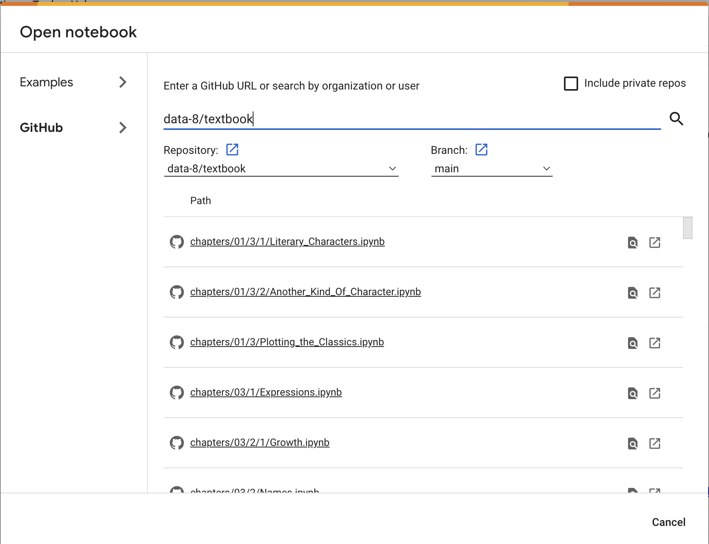

# Lab Assignment for Week 01
## Introduction to Jupyter Notebooks Using Google Colabs
## Due on [Canvas](https://psu.instructure.com/courses/2306358) on Wed., Jan. 17 at 11:59pm

The main objective of today's lab is to set up your google colab environment and run python code in a Jupyter notebook. There is also a secondary objective, which is outlined below.  First, work through the following steps:
1. If you have never done so, visit the [Penn State G Suite website](https://gsuite.psu.edu/), click Launch, and set up your account based on your Penn State login.

2. Visit the [Google Collaboratory site](https://colab.research.google.com/) and make sure you're logged in.  This is the environment in which you will do your computing.

3. You should see an orange-topped box that looks something like this:

If you don't see the box, try selecting "Open Notebook" from the File menu.

4. Click "GitHub" at the top of the orange box and make sure that the "Include private repos" box is **not** checked.  (You may have to dismiss a separate "Authorize" window in order to uncheck the box.)

5. In the text field labeled "Enter a GitHub URL...", type "data-8/textbook" and then click the magnifying glass to search for this repository.  If this is done correctly, the notebooks in the repository will automatically populate the bottom of the window.

6. Scroll to, then select, the notebook labeled "chapters/09/4/Monty_Hall_Problem.ipynb".
You should now be looking at a Jupyter notebook file with an .ipynb extension, which stands for "IPython Notebook".  From the [ipython.org](https://ipython.org/) website:  "The IPython Notebook is now known as the Jupyter Notebook. It is an interactive computational environment, in which you can combine code execution, rich text, mathematics, plots and rich media. For more details on the Jupyter Notebook, please see the [Jupyter website](https://jupyter.org/)."

7. You should "Save a copy to drive" of the notebook under the "file" menu.  The copy is the version that you will work on, and once you save a copy it will auto-save as you work.  To avoid confusion, you should probably close the browser window with the original notebook so you don’t mix up the original and the copy you are working on.

The notebook you're looking at is a copy of Section 9.4 from the textbook.  If you've never used a Jupyter notebook, the main thing you'll need to know is that you can execute the code inside any python-code window by typing "shift-Return" or clicking the play icon inside that window.   Additionally, you can add a box for code or a box for text using the "+ Code" and "+ Text" buttons near the top left.  Whenever you execute some lines of code, the results are stored and available to all of the code in other code within the same Jupyter notebook. Another way to think about this that if one code block depends on another code block, it's necessary to execute the latter before the former.  In your textbook, the code blocks are intended to be executed in order, one after the other.

**Objective:**  After you've gotten the notebook loaded, familiarize yourself with the Monty Hall problem, as well as the python code that simulates it, by reading Section 9.4 (remember, the notebook is Section 9.4).  If you want, you can also play the Monty Hall game using one of the many simulations on the web, like [this one](https://www.mathwarehouse.com/monty-hall-simulation-online/).  **Understanding the Monty Hall problem and being able to explain the results of the simulations you run is probably the most challenging aspect of this lab.**

**Your assignment** is to (a) change the name of the prize from "Car" to "Cash" in the Monty Hall game simulation, then (b) run 25000 repetitions of the simulation, then (c) add a new text box at the very end of the notebook that explains, in your own words, how you can tell from the plot of your 25000 simulations that "The simulation confirms that the contestant is twice as likely to win if she switches."
When you've completed this, you should select "Print" from the File menu, then somehow save to pdf using this option.  The pdf file that you create in this way is the file that you should upload to Canvas for grading.  
_You'll have to make multiple changes to the python code in order to complete this assignment correctly._
